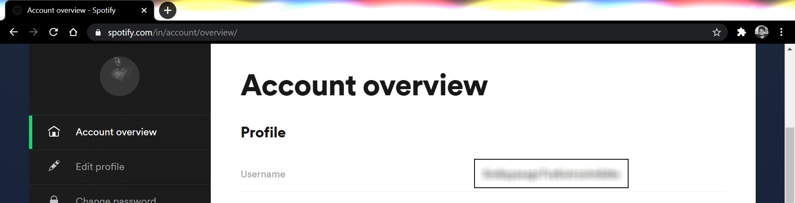
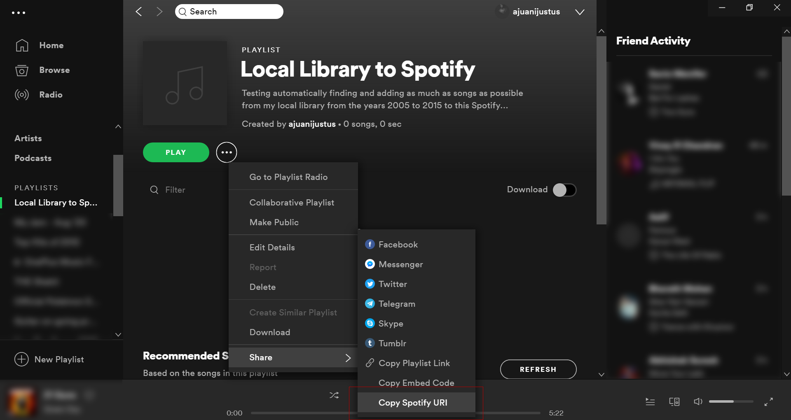

# Automate Moving Music from Local Library to Spotify
Automating extraction of metadata from mp3 files in a desired file directory, finding the songs on Spotify and adding all the songs into a Spotify playlist of choice.

## Table of Contents
* [Getting Started](#getting-started)
* [Prerequisites](#prerequisites)
    - [Technologies](#technologies)
    - [Tokens/ID](#tokens-id)
* [Local Setup](#local-setup)
* [Troubleshooting](#troubleshooting)

## Getting Started
For this project, you will need __Python__ installed on your system.

## Prerequisites
#### Technologies
1. [Spotify Web API](https://developer.spotify.com/documentation/web-api/)
2. [Requests v2.24.0](https://requests.readthedocs.io/en/master/)
3. [eyeD3 v0.9.5](https://eyed3.readthedocs.io/en/latest/)
4. [urllib3 v1.24.3](https://urllib3.readthedocs.io/en/latest/)
#### Tokens/ID
1. Spotify Web API OAuth Token.
2. Spotify Playlist ID.
3. Path to directory.
  
## Local Setup
1. Install the dependencies.  
    `pip install -r requirements.txt`
2. Collect your Spotify User ID, Playlist URI and Oauth Token From Spotify and __add it to the run.bat file__, and also add the directory of the folder with the MP3s.
    - To get your Spotify User ID, visit [Spotify Account Overview](https://www.spotify.com/in/account/overview/):
    
    - To get your Playlist ID, copy Spotify URI as in the screenshot:
    
    The Spotify URI will be in the format: spotify:playlist:2MplKvHDhfgoo9zngH7T2z, the playlist_id that you'll need is the last alphanum part: 2MplKvHDhfgoo9zngH7T2z.
    - To get your Oauth Token, visit this page: [Get Oauth](https://developer.spotify.com/console/post-playlist-tracks/) and click the Get Token button:
    
3. Run the run.bat file in your terminal:  
    `run.bat`
    
## Troubleshooting
- Spotify Oauth token expires ver quickly (in an hour), so if you come across a `KeyError` this could be caused by an expired token. So just refer back to step 2 in local setup, and generate a new token.
- The accurate metadata needs to exist in the MP3 file. If the artist name or track name is not present, it will not be added.

## Testing
I tested the code on my Spotify Account ([ajuanijustus](https://open.spotify.com/user/5m6qysxxgn7vz6uhrzolm6dto?si=C7f83x0sR5CzsqwyCWFSLA)), in [this playlist](https://open.spotify.com/playlist/2MplKvHDrLfoo9zngH7T2z?si=XHJTYDyMQwyOFxSqiJZjBw). 

